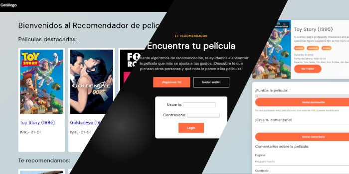

# IMDB Clone Alternative



This project is an IMDB alternative that allows users to explore and discover information about movies. The web application offers the following features:

- Browse movie catalogs
- Search for movies by title, genre, actor, director, etc.
- View movie details including synopsis, cast, and ratings
- Recommendation system based on filtering algorithms
- Ability to save favorite movies and create personalized lists

It uses matlab to generate **collaborative filtering** algorihtms and optimizes it via **Gradient Descent algorithms** and has scalability on big matrix systems.  

## Project Structure
- `/assets` - Contains CSS, JS files and images
- `/includes` - PHP files for server logic and DB connections
- `/pages` - Application views
- `/database` - SQL files to import the database
- `/matlab` - All algorithms mentioned

## Technologies Used
- Frontend: HTML, CSS, JavaScript
- Backend: PHP
- Database: MySQL

## Installation and Setup
### Prerequisites
- [XAMPP](https://www.apachefriends.org/index.html) installed on your system
- A valid [TMDB](https://developer.themoviedb.org/reference/intro/getting-started) API developer key 
- [phpMyAdmin](https://www.phpmyadmin.net/)

### Installation Steps

1. Clone this repository or download the files
```bash
git clone https://github.com/andrewyernau/movies-algorithm-web
```
2. Place all files in the htdocs folder of your XAMPP installation. Activate Apache and MySQL. 
3. Create a .env file on the root of the project and add the TMDB_API_KEY to it  
```bash
TMDB_API_KEY="..."
```
4. Start phpmyadmin and add a valid database. An example is provided on `/database/ai0.sql`. You may change the `/includes/conectar.php`'s PDO to match your database.

## Contact
If you have any questions or suggestions about this project, please feel free to open an issue in this repository. The use of PDO instead of prepares is intended and not recommended to use on production.